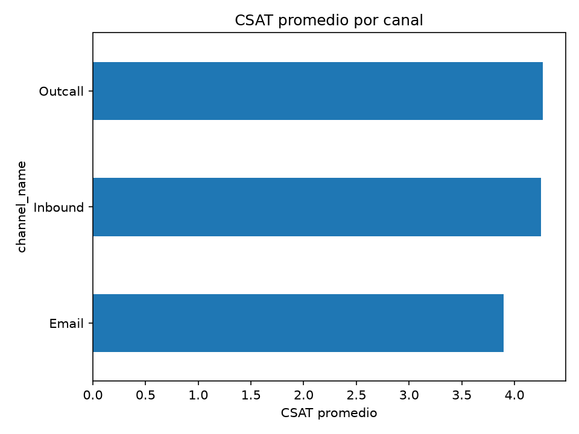

# Customer Support CSAT Analysis

Análisis de satisfacción del cliente (CSAT) sobre ~86K interacciones de soporte
de un e-commerce, con limpieza de datos en SQL y análisis exploratorio en Python.

El foco del proyecto es el pipeline completo: datos crudos → base de datos →
limpieza documentada en SQL → análisis y visualización, en vez de un notebook
suelto. Toda decisión de limpieza queda justificada con las consultas de
exploración que la sustentan.

## Dataset

- **85,907 interacciones** de soporte (canal Outcall, Inbound o Email)
- Periodo: **2023-07-28 a 2023-08-31**
- Cada fila incluye: categoría/subcategoría del caso, canal, agente, turno,
  antigüedad del agente, precio del producto, tiempos de gestión y el
  **CSAT score** (1-5) de la encuesta post-atención
- `data/raw/customer_support_data.csv` — datos originales, sin modificar
- `data/customer_support.db` — SQLite con las tablas `raw_customer_support`
  (carga cruda) y `clean_customer_support` (fechas normalizadas a ISO)

> Dataset de soporte al cliente de e-commerce con encuestas CSAT. Si vas a
> republicar este repo, confirma la licencia de uso del CSV con la fuente
> original antes de darlo por definitivo.

## Hallazgos principales

- **CSAT promedio: 4.24 / 5**, pero **Email queda claramente por debajo**
  del resto de canales (3.90 vs. 4.25-4.27 en Inbound/Outcall).
- **La antigüedad del agente importa**: agentes "On Job Training" tienen el
  CSAT más bajo (4.15) frente a agentes con 61-90 días (4.35, el más alto).
- **El turno de la mañana es el más débil** (4.19, y concentra el 48% del
  volumen), mientras que el turno "Split" tiene el mejor desempeño (4.43).
- **Cancelación** es la categoría con peor CSAT (3.99); **Devoluciones**
  ("Returns") es la más frecuente (44K casos, 51% del total) y con buen CSAT
  (4.35).



## Estructura del proyecto

```
data/
  raw/customer_support_data.csv   # datos originales
  customer_support.db             # SQLite (raw + clean)
  customer_support.sqbpro         # proyecto de DB Browser for SQLite
sql/
  01_exploration.sql              # calidad de datos: nulos, duplicados, formatos de fecha
  02_cleaning.sql                 # raw_customer_support -> clean_customer_support
python/
  load_to_sqlite.py               # CSV -> SQLite (solo normaliza nombres de columna)
  analysis.py                     # lectura de clean_customer_support + gráfico
reports/
  figures/csat_by_channel.png
powerbi/                          # dashboard (en construcción)
```

## Cómo correrlo

```bash
pip install -r requirements.txt

# 1. Cargar el CSV crudo a SQLite
python python/load_to_sqlite.py

# 2. Limpiar los datos (crea clean_customer_support)
sqlite3 data/customer_support.db < sql/01_exploration.sql   # opcional, solo exploración
sqlite3 data/customer_support.db < sql/02_cleaning.sql

# 3. Analizar y generar el gráfico
python python/analysis.py
```

(También puedes abrir `data/customer_support.sqbpro` en
[DB Browser for SQLite](https://sqlitebrowser.org/) para correr los scripts
SQL de forma interactiva.)

## Por qué SQL para la limpieza

`load_to_sqlite.py` carga el CSV tal cual (solo normaliza nombres de
columna). Toda transformación real de datos —reconstruir las 4 columnas de
fecha desde texto no-ISO (`DD/MM/YYYY`, `DD-Mon-YY`) a un formato que SQLite
pueda parsear— vive en `sql/02_cleaning.sql`, justificada por los hallazgos
de `sql/01_exploration.sql` (nulos por canal/categoría, formato confirmado
como día/mes, validación de que el 100% de las fechas reconstruidas son
parseables).

## Stack

Python (pandas, matplotlib) · SQLite · SQL

## Autor

Sebas — [github.com/SebasPerlaza895](https://github.com/SebasPerlaza895)
